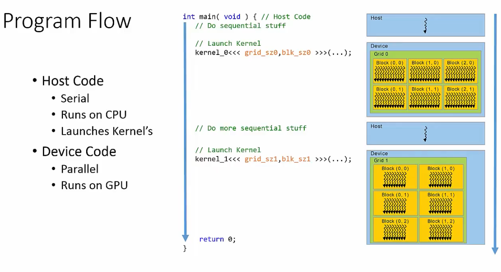

# 1 Fundamentos: GPU y CUDA

## 1.1 Programación heterogénea (host + device)

Modelo donde **CPU y GPU cooperan**: la CPU es buena en lógica secuencial y control; la GPU en paralelismo masivo de datos.

### 1.1.1 Roles
- **Host**: CPU + RAM del sistema. Dirige el programa, gestiona SO/red/ficheros.
- **Device**: GPU + VRAM. Ejecuta el trabajo paralelo cuando el host se lo pide.

**Memorias físicamente separadas** → la CPU no puede leer VRAM directamente, ni viceversa. Restricción fundamental que marca todo el diseño.

### 1.1.2 Modelo de ejecución

Programa **secuencial con regiones paralelas**: el host ejecuta código serie, lanza kernels al device, espera resultado, sigue.

### 1.1.3 Implicación: copias explícitas

Flujo canónico:
- `cudaMalloc` → reservar en device
- `cudaMemcpy` HostToDevice → subir entrada
- Lanzar kernel
- `cudaMemcpy` DeviceToHost → bajar resultado
- `cudaFree`

**Consecuencias críticas:**
- Las transferencias por PCIe son lentas → si el kernel hace poco trabajo por byte transferido, la GPU puede ser **más lenta** que la CPU.
- **Minimizar copias**: cargar una vez, encadenar varios kernels, devolver al final.

> Unified Memory y NVLink suavizan esta separación, pero el modelo mental de "dos memorias que sincronizar" sigue siendo el correcto para entender rendimiento.

## 1.2 Arquitectura GPU
### 1.2.1 CPU vs GPU: por qué la jerarquía se ve así

CPU y GPU **gastan los transistores en cosas distintas**:

- **CPU**: pocos cores muy potentes. Mucho silicio en caches grandes y control sofisticado (predicción de saltos, OoO, especulación) para que **un solo thread vaya rápido**.
- **GPU**: miles de cores simples. Casi todo el silicio son ALUs; control mínimo, caches pequeñas. No intenta acelerar un thread, sino mantener **muchísimos en vuelo a la vez**.

¿Cómo tolera entonces la GPU la latencia de memoria sin caches grandes? **Ocultándola con paralelismo**: cuando un warp se queda esperando VRAM, el SM cambia instantáneamente a otro warp listo. Con suficientes warps activos, la espera de unos se solapa con el trabajo de otros y la latencia "desaparece".

- GPU: 
### 1.2.2 Los niveles: SM, warp, thread

- **SM (Streaming Multiprocessor)**: Mini-procesador independiente con sus cores, registros, shared memory y scheduler. 
    - **Cada bloque de threads se asigna entero a un SM** y se queda allí hasta terminar.
        - Por eso los threads de un mismo bloque pueden cooperar (shared memory) y los de bloques distintos no.

    Dentro de un SM:
    - **CUDA cores** (64-128/SM): ALUs FP32/INT32, el caballo de batalla.
    - **Tensor cores** (4-8/SM): unidades de matmul. Lo que hace que DL en GPU vuele.

- **Thread**: ALU que ejecuta operaciones aritmeticológicas
    - SIMT = Single Instruction, Multiple Threads
    - NO se ejecutan todos los hilos de la GPU a la vez, se agrupan en warps

- Warp: unidad mínima de ejecución formada por 32 hilos (threads) que ejecutan la misma instrucción simultáneamente sobre datos distintos (modelo SIMT).
    - avanzan en lockstep: sincronizados paso a paso, ejecutando exactamente la misma instrucción en el mismo ciclo de reloj.

MAPEO:
- GPU: Grid
- SM: bloque
- cuda core: thread
### 1.2.3 La memoria, mapeada a los niveles

Cada nivel hardware tiene su memoria propia. Cuanto más cerca del thread, más rápida y más pequeña:

| Nivel | Memoria | Latencia | Tamaño típico | Notas |
|---|---|---|---|---|
| Thread | **Registers** | ~1 ciclo | ~255 regs/thread | Privados, rapidísimos |
| Thread | **Local** | ~400-800 ciclos (cacheable) | hasta 512 KB/thread | Privada pero vive en global (spilling) |
| Bloque (en un SM) | **Shared** + L1 | ~10-30 ciclos | 96-228 KB/SM | Cooperación entre threads del bloque |
| Grid | L2 | ~200 ciclos | 40-50 MB | Caché global automática |
| Grid | **Global (VRAM)** | ~400-800 ciclos | 8-80 GB | Datos de `cudaMemcpy` |
| Grid (solo lectura) | **Constant** | cacheada | 64 KB | Óptima si todos leen el mismo dato |
| Grid (solo lectura) | **Texture** | cacheada | depende | Caché espacial 2D/3D |

## 1.3 Qué es CUDA

CUDA (**Compute Unified Device Architecture**, NVIDIA, 2006) es **tres cosas a la vez**:

- **Plataforma de cómputo paralelo** de propósito general (GPGPU): convertir GPUs en aceleradores genéricos para ML, simulación, finanzas, etc.
- **Modelo de programación paralelo**: la abstracción que usa el programador (kernels, threads, blocks, grids, jerarquía de memoria, sincronización). → Sección 2.
- **ISA**: PTX (virtual) y SASS (físico, por arquitectura). El compilador genera PTX, el driver lo recompila a SASS para la GPU concreta.

Lenguaje principal: **CUDA C/C++** (C/C++ + extensiones: `__global__`, `<<<...>>>`, `threadIdx`...). Bindings para Fortran, Python (CuPy, Numba, PyCUDA), Java, OpenACC.

### 1.3.1 Ecosistema de librerías

> **Regla de oro**: antes de escribir tu propio kernel, busca si ya existe la librería. Las de NVIDIA están escritas por gente que conoce el hardware al milímetro.

Principales librerías NVIDIA:

| Librería | Para qué |
|---|---|
| **cuBLAS** | BLAS (matmul densa, productos matriz-vector). Base de toda álgebra lineal en GPU |
| **cuFFT** | Transformadas de Fourier |
| **cuRAND** | Números aleatorios |
| **cuSPARSE** | Álgebra lineal con matrices dispersas |
| **cuDNN** | Primitivas DL (conv, pooling, norm, atención). Lo que usan PyTorch/TF |
| **TensorRT** | Optimizador + runtime de inferencia DL (fusión, autotuning, FP16/INT8/FP4) |
| **NPP** | Procesado de imagen y señal |
| **Thrust** | Estilo STL en GPU (sort, reduce, scan, transform) |

Terceros: **MAGMA** (LAPACK híbrido CPU+GPU para LU/QR/Cholesky, autovalores).

**Wrappers de alto nivel**: Matlab `gpuArray`, Python (CuPy ≈ NumPy en GPU, Numba `@cuda.jit`, PyCUDA), PyTorch/JAX/TensorFlow.

### 1.3.2 CUDA Toolkit

Paquete oficial de desarrollo. Incluye:
- **nvcc**: compilador. Separa código host (→ gcc/clang/MSVC) y device (→ PTX/SASS).
- Librerías (cuBLAS, etc.; cuDNN aparte).
- **Runtime API y Driver API**: las dos APIs de bajo nivel.
- **Profiling/debugging**: `nsys` (Nsight Systems, traza temporal), `ncu` (Nsight Compute, profiling profundo de kernels), `cuda-gdb`, `compute-sanitizer` (race conditions, accesos inválidos).
- Samples y docs.

**Compatibilidad**: drivers modernos suelen soportar Toolkits antiguos (forward compat), no al revés.

## 1.4 Compute Capability y arquitecturas

**Compute Capability (CC)**: versión `mayor.menor` que identifica las capacidades hardware de una GPU. El mayor = arquitectura; el menor = mejoras incrementales.

| CC | Arquitectura | Año | GPUs típicas | Hito clave |
|---|---|---|---|---|
| 1.x | Tesla | 2006 | G80, GT200 | Primera CUDA |
| 2.x | Fermi | 2010 | GF100 | Caches reales, ECC |
| 3.x | Kepler | 2012 | K20/K40/K80 | Dynamic parallelism, Hyper-Q |
| 5.x | Maxwell | 2014 | GTX 980 | Eficiencia energética |
| 6.x | Pascal | 2016 | P100, GTX 1080 | NVLink, FP16 |
| 7.0 | Volta | 2017 | V100 | **Tensor Cores**, indep. thread scheduling |
| 7.5 | Turing | 2018 | T4, RTX 2080 | RT cores, INT8/INT4 tensor |
| 8.x | Ampere | 2020 | A100, RTX 3090 | TF32, sparsity, MIG |
| 8.9 | Ada Lovelace | 2022 | RTX 4090, L40 | FP8, 4ª gen tensor |
| 9.0 | Hopper | 2022 | H100 | Transformer Engine, FP8, TMA, async |
| 10.x | Blackwell | 2024 | B100/B200/GB200 | FP4, 2ª gen Transformer Engine |

**Por qué importa:**
- **Compilación**: `nvcc -arch=sm_80` (Ampere), `sm_90` (Hopper). Compilar para CC nueva no corre en GPUs viejas; compilar para vieja corre en nuevas pero sin features modernas.
- **Features**: FlashAttention requiere CC ≥ 7.5, FP8 tensor cores requieren CC 9.0. Lo primero que miras al leer un paper de optimización.
- **Segmentación**: data center (H100, A100) vs consumo (RTX 4090) pueden compartir arquitectura pero diferir en NVLink, ECC, MIG, FP64.

## 1.5 Cuándo conviene GPGPU

La GPU **no es siempre la solución**. Coste fijo de transferencias y lanzamiento → tiene que compensar.

| Criterio | Favorable | Desfavorable |
|---|---|---|
| **Intensidad aritmética** (flops/byte) | Alta (O(N)+) | Baja (O(1)) |
| **Paralelismo de datos** | Masivo, independiente | Secuencial, dependiente |
| **Control de flujo** | Simple, regular | Branches complejos |
| **Tamaño del problema** | Grande (>10⁴ elementos) | Pequeño |
| **Patrón de acceso a memoria** | Coalescente, regular | Aleatorio, disperso |

**Ejemplos canónicos:**
- ✅ **GEMM N×N**: transfieres 3·N² datos, haces 2·N³ ops → intensidad O(N). GPU órdenes de magnitud más rápida.
- ❌ **Suma de vectores**: transfieres 3·N, haces N ops → intensidad O(1). Apenas gana sobre CPU.

**Aplicación a inference de LLMs**: matmuls de QKV/FFN tienen altísima intensidad y paralelismo → GPU es la pieza central. Pero en decoding con KV cache pequeña la intensidad cae → ahí surgen optimizaciones como continuous batching y speculative decoding.

---