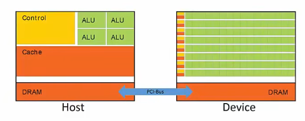
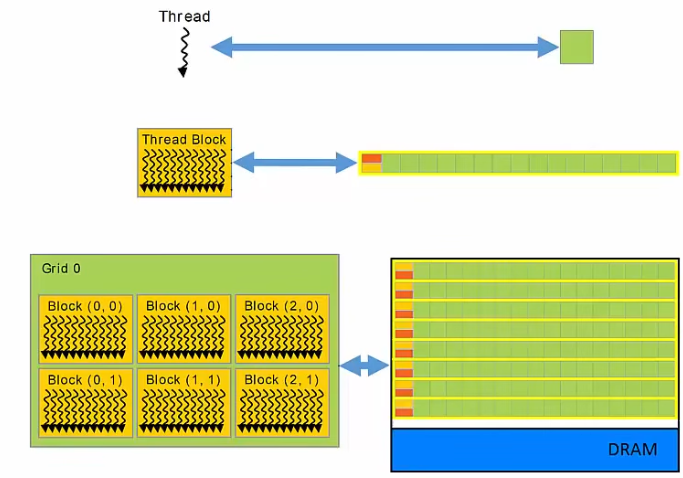
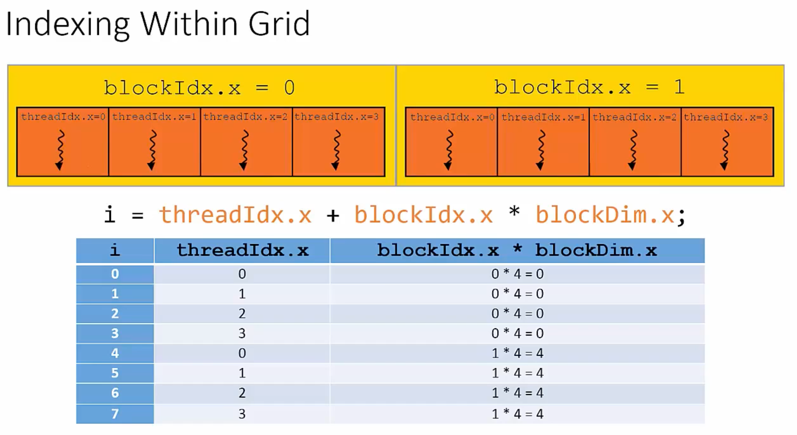
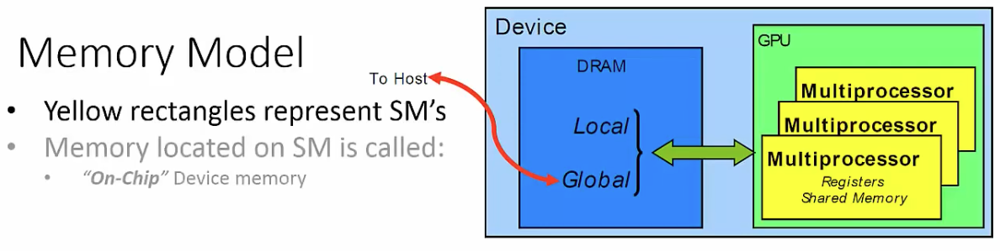
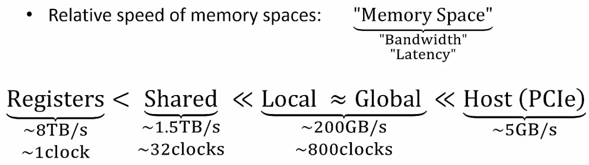
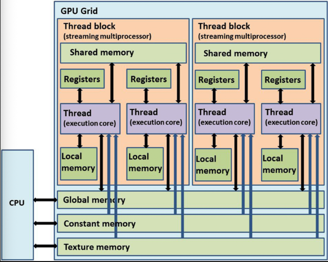

# 2 Modelo de programación de CUDA

El modelo de programación de CUDA es la **capa de abstracción** que se interpone entre tu código y el hardware de la GPU. Te da un vocabulario (threads, bloques, grids, memoria jerárquica) con el que expresas trabajo paralelo, y el runtime se encarga de mapearlo al hardware concreto.

## 2.1 Idea general

Antes de entrar en kernels, threads y warps, conviene fijar **qué problema resuelve este modelo** y **qué dos máquinas hay involucradas**. Sin estas dos ideas, el resto se vuelve mecánica sin sentido.

### 2.1.1 Qué resuelve el modelo de programación de CUDA

- El problema: las GPUs cambian constantemente (distinto número de SMs, distinta CC, distinta memoria) y no quieres reescribir tu código para cada una.
- La solución: declarar el trabajo en términos **lógicos** (threads, bloques, grid) en vez de **físicos** (cores, SMs).
- CUDA mapea automáticamente esos elementos lógicos al hardware concreto en tiempo de ejecución.

Idea clave: en vez de asignar trabajo a cores específicos, **declaras mucho trabajo independiente** y CUDA lo distribuye:

- Divides el problema en **bloques independientes** entre sí
- Cada bloque se subdivide en **threads** que pueden cooperar
- CUDA ejecuta los bloques en cualquier orden, en paralelo o en serie, según los SMs disponibles

### 2.1.2 Host y device: dos máquinas, dos memorias

- En un programa CUDA conviven dos máquinas distintas:
    - **Host**: la CPU y su RAM
    - **Device**: la GPU y su VRAM
- Cada una tiene su propio espacio de memoria, su propio flujo de control y sus propios punteros
- Un puntero del host no es desreferenciable desde el device y viceversa (salvo Unified Memory, que veremos en 2.5.4)


Consecuencia práctica: la mayoría de errores de principiante vienen de confundir punteros host con punteros device.

### 2.1.3 Escalabilidad automática

- El mismo binario corre en GPUs distintas aprovechando los SMs disponibles
- Esto solo funciona porque los bloques son **independientes** entre sí (ver 2.3.4)

```
GPU con 2 SMs → 4 bloques por SM (en serie)
GPU con 4 SMs → 2 bloques por SM
GPU con 8 SMs → 1 bloque por SM (todo en paralelo)
```

### 2.1.4 Mapa del tema

- 2.2 **Kernels** — la función que ejecutan los threads
- 2.3 **Jerarquía de threads** — cómo se organizan los threads (modelo lógico)
- 2.4 **Warps** — cómo los ejecuta el hardware (modelo físico)
- 2.5 **Modelo de memoria** — dónde viven los datos y cómo se accede
- 2.6 **Sincronización** — cómo coordinas threads y kernels
- 2.7 **Patrones de mapeo problema → grid/block**
- 2.8 **Visión de conjunto** — flujo completo, SIMT vs SIMD, asincronía

---

## 2.2 Kernels

Un **kernel** es la unidad básica de trabajo paralelo en CUDA: una función que se ejecuta simultáneamente por muchos threads sobre datos distintos.

### 2.2.1 Qué es un kernel

Un **kernel** es una función C/C++ que se ejecuta en el device y que se lanza **muchas veces en paralelo**, una vez por cada thread del grid.

La idea: lo que en CPU sería un bucle `for` de N iteraciones, en CUDA se convierte en un kernel lanzado por N threads simultáneos, cada uno operando sobre un elemento distinto.

```c
// CPU: bucle secuencial
for (int i = 0; i < N; i++)
    C[i] = A[i] + B[i];

// GPU: el bucle desaparece, cada thread hace UNA suma
__global__ void VecAdd(float* A, float* B, float* C) {
    int i = threadIdx.x;
    C[i] = A[i] + B[i];
}
```

Características importantes:

- Devuelve siempre `void` (los resultados se escriben en memoria del device)
- Cada thread tiene un identificador único (`threadIdx`, `blockIdx`) que usa para decidir sobre qué dato operar
- Su lanzamiento es **asíncrono**: el host no espera a que termine, sigue ejecutando el código siguiente
    - Para esperar al kernel se usa `cudaDeviceSynchronize()`

### 2.2.2 Sintaxis: `__global__`, `__device__`, `__host__`

CUDA distingue dónde se **llama** y dónde se **ejecuta** una función mediante tres especificadores:

| Especificador | Llamada | Ejecución | Uso |
|---|---|---|---|
| `__global__` | Host | Device | Definir un kernel (entry point del device) |
| `__device__` | Device | Device | Funciones auxiliares dentro de kernels |
| `__host__` | Host | Host | Función normal de CPU (es el default) |
| `__host__ __device__` | Ambos | Ambos | Compila para ambos lados |

Notas:

- `__global__` obliga a `void` como tipo de retorno
- `__device__` puede devolver valores (se invoca desde un kernel como una función normal)
- `__host__ __device__` es útil para funciones matemáticas que quieres reutilizar en CPU y GPU

### 2.2.3 Lanzamiento: `<<<grid, block, sharedMem, stream>>>`

El lanzamiento de un kernel se hace desde el host indicando cuántos threads se lanzan y cómo se organizan:

```c
VecAdd<<<numBlocks, threadsPerBlock>>>(A, B, C);
```

- **`numBlocks`** (`gridDim`): cuántos bloques tiene el grid
- **`threadsPerBlock`** (`blockDim`): nº de threads por bloque
    - Limitado a **1024 threads** (límite hardware)
    - Debe ser múltiplo de 32 para alinearse con los warps
- Total de threads = `gridDim × blockDim`

Ambos parámetros pueden ser `int` (1D) o `dim3` (1D, 2D o 3D):

```c
VecAdd<<<1, N>>>(A, B, C);          // 1 bloque, N threads (1D)
VecAdd<<<8, 256>>>(A, B, C);        // 8 bloques de 256 threads
                                     // (2048 threads totales)

dim3 grid(4, 4);                    // grid 2D de 4×4 bloques
dim3 block(16, 16);                 // bloques 2D de 16×16 threads
MatrixOp<<<grid, block>>>(A, B, C); // útil para matrices
```

La sintaxis completa tiene **cuatro** parámetros, los dos últimos opcionales:

```c
kernel<<<grid, block>>>(args);
kernel<<<grid, block, sharedMemBytes>>>(args);
kernel<<<grid, block, sharedMemBytes, stream>>>(args);
```

| Parámetro | Significado |
|---|---|
| `grid` | `int` o `dim3`: tamaño del grid |
| `block` | `int` o `dim3`: tamaño del bloque |
| `sharedMemBytes` | Bytes de shared memory dinámica (default 0) |
| `stream` | Stream donde se lanza (default stream 0) |

---

## 2.3 Jerarquía de threads

CUDA organiza los threads en una **jerarquía de tres niveles** que refleja cómo se reparte el trabajo y cómo cooperan los threads entre sí.

### 2.3.1 Thread → Block → Grid (1D/2D/3D)

- **Thread**: la unidad mínima de ejecución, ejecuta el código del kernel sobre un dato
- **Block**: grupo de threads que **pueden cooperar** entre sí (compartir memoria rápida, sincronizarse)
    - Un block se asocia a un SM, pero un SM puede tener varios blocks
    - Todos los threads de un bloque viven en el mismo SM
- **Grid**: conjunto de todos los bloques de un kernel
    - Corresponde al device completo
    - Los bloques son **independientes** entre sí
- **Warp**: unidad mínima de ejecución formada por 32 threads que ejecutan la misma instrucción simultáneamente sobre datos distintos (modelo SIMT)
    - Avanzan en lockstep: sincronizados paso a paso, ejecutando exactamente la misma instrucción en el mismo ciclo de reloj
    - Detalle de hardware, lo veremos en 2.4



#### Dimensionalidad: 1D, 2D o 3D

Tanto el grid como los bloques pueden tener 1, 2 o 3 dimensiones. Es solo una conveniencia notacional para que el código case con la forma natural del problema:

| Dimensión | Caso de uso típico |
|---|---|
| 1D | Vectores, secuencias |
| 2D | Matrices, imágenes |
| 3D | Volúmenes, simulaciones espaciales |

### 2.3.2 Variables built-in

Dentro de un kernel, CUDA expone **cuatro variables built-in** que cada thread usa para saber dónde está en la jerarquía:

| Variable | Tipo | Qué representa | ¿Igual para todos? |
|---|---|---|---|
| `threadIdx` | `dim3` | Posición del thread **dentro de su bloque** | No (única por thread) |
| `blockIdx` | `dim3` | Posición del bloque **dentro del grid** | No (única por bloque) |
| `blockDim` | `dim3` | Nº de threads por bloque | Sí |
| `gridDim` | `dim3` | Nº de bloques por grid | Sí |

Las cuatro variables son `dim3`, así que tienen tres componentes `.x`, `.y`, `.z`.

### 2.3.3 Cálculo de índice global

- `threadIdx` solo identifica al thread dentro de su bloque
- Al lanzar varios bloques, necesitas un **índice global** que identifique al thread dentro de todo el grid
    - Fórmula: `blockIdx * blockDim + threadIdx`
- Un bloque 1D tiene `blockDim.y == blockDim.z == 1`

#### Convención de ejes: `.x` = columna (horizontal), `.y` = fila (vertical)

CUDA sigue una **convención gráfica tipo pantalla/imagen**, no la convención matricial matemática:

- Origen en la esquina **superior izquierda**
- `.x` crece hacia la **derecha** → mapea a la **columna**
- `.y` crece hacia **abajo** → mapea a la **fila**
- `.z` crece hacia adentro (profundidad)

```
            x=0   x=1   x=2
          ┌─────┬─────┬─────┐
     y=0  │     │     │     │   ← y avanza hacia abajo
          ├─────┼─────┼─────┤
     y=1  │     │     │     │
          ├─────┼─────┼─────┤
     y=2  │     │     │     │
          └─────┴─────┴─────┘
```

Por eso al indexar una matriz `A` de ancho `W` almacenada en row-major, `j` (la fila) va primero:

```c
int i = blockIdx.x * blockDim.x + threadIdx.x;   // columna
int j = blockIdx.y * blockDim.y + threadIdx.y;   // fila
A[j * W + i];                                    // fila primero, columna después
```

> En matemáticas suele escribirse `(fila, columna) = (i, j)`. En CUDA, `(i, j) = (columna, fila)` porque `i` viene del eje `.x`. Es la principal fuente de confusión al pasar de pseudocódigo matricial a kernels 2D.

#### Dado un thread, calcular (FILA, COLUMNA) → (I, J) global que le toca

```c
// 1D
int i = blockIdx.x * blockDim.x + threadIdx.x;

// 2D
int i = blockIdx.x * blockDim.x + threadIdx.x;   // columna
int j = blockIdx.y * blockDim.y + threadIdx.y;   // fila

// 3D
int i = blockIdx.x * blockDim.x + threadIdx.x;
int j = blockIdx.y * blockDim.y + threadIdx.y;
int k = blockIdx.z * blockDim.z + threadIdx.z;
```

#### Dado una celda global, calcular qué thread la procesa

```c
blockIdx.x  = i_global / blockDim.x       // división entera (cociente)
threadIdx.x = i_global % blockDim.x       // módulo (resto)

blockIdx.y  = j_global / blockDim.y
threadIdx.y = j_global % blockDim.y
```

#### Ejemplo visual (1D)

Configuración:
- `gridDim.x` = 2 → **2 bloques**
- `blockDim.x` = 4 → **4 threads por bloque**
- **Total: 8 threads**



#### Ejemplo visual (2D)

Queremos procesar una matriz 6×6.

Configuración:
- `gridDim` = (2, 2) → **4 bloques**
- `blockDim` = (3, 3) → **9 threads por bloque**
- **Total: 36 threads** (matriz 6×6)

```
Matriz 3×4:           Memoria lineal (12 elementos):
[ a  b  c  d ]        [ a b c d | e f g h | i j k l ]
[ e  f  g  h ]          fila 0     fila 1    fila 2
[ i  j  k  l ]
```

```
                  blockIdx.x = 0          blockIdx.x = 1
                ┌──────────────┐        ┌──────────────┐
                │ ·   ·   ·    │        │ ·   ·   ·    │
blockIdx.y = 0  │ ·   ·   ·    │        │ ·   ·   ·    │
                │ ·   ·   ·    │        │ ·   ·   ·    │
                ├──────────────┤        ├──────────────┤
                │ ·   ·   ·    │        │ ·   ·   ·    │
blockIdx.y = 1  │ ·   ·   ·    │        │ ·   ·   ·    │
                │ ·   ·   ·    │        │ ·   ·   ·    │
                └──────────────┘        └──────────────┘
```

```c
// DADO UN THREAD, CALCULAR QUE CELDA DE LA MATRIZ ORIGINAL PROCESA (i,j)
int i = blockIdx.x * blockDim.x + threadIdx.x;   // COLUMNA GLOBAL (0-5)
int j = blockIdx.y * blockDim.y + threadIdx.y;   // FILA GLOBAL (0-5)
```

| Thread origen | `blockIdx.x · blockDim.x` | `+ threadIdx.x` | `blockIdx.y · blockDim.y` | `+ threadIdx.y` | Celda `(i, j)` |
|---|---|---|---|---|---|
| bloque (0, 0), thread (0, 0) | 0 · 3 = 0 | 0 + 0 = 0 | 0 · 3 = 0 | 0 + 0 = 0 | **(0, 0)** |
| bloque (0, 0), thread (2, 2) | 0 · 3 = 0 | 0 + 2 = 2 | 0 · 3 = 0 | 0 + 2 = 2 | **(2, 2)** |
| bloque (1, 0), thread (0, 0) | 1 · 3 = 3 | 3 + 0 = 3 | 0 · 3 = 0 | 0 + 0 = 0 | **(3, 0)** |
| bloque (1, 0), thread (2, 1) | 1 · 3 = 3 | 3 + 2 = 5 | 0 · 3 = 0 | 0 + 1 = 1 | **(5, 1)** |
| bloque (0, 1), thread (0, 0) | 0 · 3 = 0 | 0 + 0 = 0 | 1 · 3 = 3 | 3 + 0 = 3 | **(0, 3)** |
| bloque (1, 1), thread (1, 1) | 1 · 3 = 3 | 3 + 1 = 4 | 1 · 3 = 3 | 3 + 1 = 4 | **(4, 4)** |
| bloque (1, 1), thread (2, 2) | 1 · 3 = 3 | 3 + 2 = 5 | 1 · 3 = 3 | 3 + 2 = 5 | **(5, 5)** |

```c
// DADA UNA CELDA (i,j) DE LA MATRIZ ORIGINAL, CALCULAR QUÉ THREAD LA PROCESA
blockIdx.x  = i / blockDim.x       threadIdx.x = i % blockDim.x
blockIdx.y  = j / blockDim.y       threadIdx.y = j % blockDim.y
```

- El **cociente** (`/`) indica en qué bloque cae la celda
- El **resto** (`%`) indica la posición del thread dentro del bloque

| Celda `(i, j)` | `i / blockDim.x` | `i % blockDim.x` | `j / blockDim.y` | `j % blockDim.y` | Thread resultante |
|---|---|---|---|---|---|
| **(0, 0)** | 0 / 3 = 0 | 0 % 3 = 0 | 0 / 3 = 0 | 0 % 3 = 0 | bloque (0, 0), thread (0, 0) |
| **(2, 2)** | 2 / 3 = 0 | 2 % 3 = 2 | 2 / 3 = 0 | 2 % 3 = 2 | bloque (0, 0), thread (2, 2) |
| **(3, 0)** | 3 / 3 = 1 | 3 % 3 = 0 | 0 / 3 = 0 | 0 % 3 = 0 | bloque (1, 0), thread (0, 0) |
| **(5, 1)** | 5 / 3 = 1 | 5 % 3 = 2 | 1 / 3 = 0 | 1 % 3 = 1 | bloque (1, 0), thread (2, 1) |
| **(0, 3)** | 0 / 3 = 0 | 0 % 3 = 0 | 3 / 3 = 1 | 3 % 3 = 0 | bloque (0, 1), thread (0, 0) |
| **(4, 4)** | 4 / 3 = 1 | 4 % 3 = 1 | 4 / 3 = 1 | 4 % 3 = 1 | bloque (1, 1), thread (1, 1) |
| **(5, 5)** | 5 / 3 = 1 | 5 % 3 = 2 | 5 / 3 = 1 | 5 % 3 = 2 | bloque (1, 1), thread (2, 2) |

#### Ejemplo visual (3D)

Configuración:
- `gridDim` = (2, 2, 2) → **8 bloques**
- `blockDim` = (2, 2, 2) → **8 threads por bloque**
- **Total: 64 threads** (volumen 4×4×4)

```
       k=3  ┌───┬───┬───┬───┐
            │   │   │   │   │       Cada celda es un thread con
       k=2  ├───┼───┼───┼───┤       coordenadas globales (i, j, k).
            │   │   │   │   │
       k=1  ├───┼───┼───┼───┤       8 bloques apilados en 3D:
            │   │   │   │   │       - 2 en x (i: 0-1 | 2-3)
       k=0  ├───┼───┼───┼───┤       - 2 en y (j: 0-1 | 2-3)
            │   │   │   │   │       - 2 en z (k: 0-1 | 2-3)
            └───┴───┴───┴───┘
             i=0  i=1  i=2  i=3
```

```c
int i = blockIdx.x * blockDim.x + threadIdx.x;   // 0-3
int j = blockIdx.y * blockDim.y + threadIdx.y;   // 0-3
int k = blockIdx.z * blockDim.z + threadIdx.z;   // 0-3
```

| Thread origen | `blockIdx.x · blockDim.x` | `+ threadIdx.x` | `blockIdx.y · blockDim.y` | `+ threadIdx.y` | `blockIdx.z · blockDim.z` | `+ threadIdx.z` | Celda `(i, j, k)` |
|---|---|---|---|---|---|---|---|
| bloque (0, 0, 0), thread (0, 0, 0) | 0 · 2 = 0 | 0 + 0 = 0 | 0 · 2 = 0 | 0 + 0 = 0 | 0 · 2 = 0 | 0 + 0 = 0 | **(0, 0, 0)** |
| bloque (0, 0, 0), thread (1, 1, 1) | 0 · 2 = 0 | 0 + 1 = 1 | 0 · 2 = 0 | 0 + 1 = 1 | 0 · 2 = 0 | 0 + 1 = 1 | **(1, 1, 1)** |
| bloque (1, 0, 0), thread (0, 0, 0) | 1 · 2 = 2 | 2 + 0 = 2 | 0 · 2 = 0 | 0 + 0 = 0 | 0 · 2 = 0 | 0 + 0 = 0 | **(2, 0, 0)** |
| bloque (1, 1, 0), thread (1, 1, 0) | 1 · 2 = 2 | 2 + 1 = 3 | 1 · 2 = 2 | 2 + 1 = 3 | 0 · 2 = 0 | 0 + 0 = 0 | **(3, 3, 0)** |
| bloque (0, 0, 1), thread (0, 0, 0) | 0 · 2 = 0 | 0 + 0 = 0 | 0 · 2 = 0 | 0 + 0 = 0 | 1 · 2 = 2 | 2 + 0 = 2 | **(0, 0, 2)** |
| bloque (1, 1, 1), thread (1, 1, 1) | 1 · 2 = 2 | 2 + 1 = 3 | 1 · 2 = 2 | 2 + 1 = 3 | 1 · 2 = 2 | 2 + 1 = 3 | **(3, 3, 3)** |

```c
// DADA UNA CELDA (i,j,k) GLOBAL, CALCULAR QUÉ THREAD LA PROCESA
blockIdx.x  = i / blockDim.x       threadIdx.x = i % blockDim.x
blockIdx.y  = j / blockDim.y       threadIdx.y = j % blockDim.y
blockIdx.z  = k / blockDim.z       threadIdx.z = k % blockDim.z
```

| Celda `(i, j, k)` | `i / blockDim.x` | `i % blockDim.x` | `j / blockDim.y` | `j % blockDim.y` | `k / blockDim.z` | `k % blockDim.z` | Thread resultante |
|---|---|---|---|---|---|---|---|
| **(0, 0, 0)** | 0 / 2 = 0 | 0 % 2 = 0 | 0 / 2 = 0 | 0 % 2 = 0 | 0 / 2 = 0 | 0 % 2 = 0 | bloque (0, 0, 0), thread (0, 0, 0) |
| **(1, 1, 1)** | 1 / 2 = 0 | 1 % 2 = 1 | 1 / 2 = 0 | 1 % 2 = 1 | 1 / 2 = 0 | 1 % 2 = 1 | bloque (0, 0, 0), thread (1, 1, 1) |
| **(2, 0, 0)** | 2 / 2 = 1 | 2 % 2 = 0 | 0 / 2 = 0 | 0 % 2 = 0 | 0 / 2 = 0 | 0 % 2 = 0 | bloque (1, 0, 0), thread (0, 0, 0) |
| **(3, 3, 0)** | 3 / 2 = 1 | 3 % 2 = 1 | 3 / 2 = 1 | 3 % 2 = 1 | 0 / 2 = 0 | 0 % 2 = 0 | bloque (1, 1, 0), thread (1, 1, 0) |
| **(0, 0, 2)** | 0 / 2 = 0 | 0 % 2 = 0 | 0 / 2 = 0 | 0 % 2 = 0 | 2 / 2 = 1 | 2 % 2 = 0 | bloque (0, 0, 1), thread (0, 0, 0) |
| **(3, 3, 3)** | 3 / 2 = 1 | 3 % 2 = 1 | 3 / 2 = 1 | 3 % 2 = 1 | 3 / 2 = 1 | 3 % 2 = 1 | bloque (1, 1, 1), thread (1, 1, 1) |

#### Check de límites

- **Problema**: como `blockDim` es fijo (múltiplo de 32) y casi nunca divide el tamaño del problema, lanzas **más threads de los que necesitas**. Los sobrantes accederían fuera del array → crash o corrupción silenciosa.
- **Ejemplo**: sumar dos vectores de N=1000 con bloques de 256:
    ```
    numBlocks = (1000 + 255) / 256 = 4   ← ceil
    total threads = 4 · 256 = 1024       ← sobran 24
    ```
- **Solución**: añadir un `if (i < N)` que descarta los threads sobrantes
    ```c
    __global__ void VecAdd(int N, float* A, float* B, float* C) {
        int i = blockIdx.x * blockDim.x + threadIdx.x;
        if (i < N) {                     // ← threads i = 1000..1023 no entran
            C[i] = A[i] + B[i];
        }
    }
    ```
- **Reglas**:
    - Número de bloques (ceil): `numBlocks = (N + threadsPerBlock - 1) / threadsPerBlock`
    - En 2D/3D, misma fórmula por eje y check combinado: `if (i < W && j < H)`

### 2.3.4 Independencia de bloques → escalabilidad

Este es **el invariante más importante** del modelo CUDA, el que hace posible toda la escalabilidad automática:

> Los bloques de un grid deben poder ejecutarse **en cualquier orden, en paralelo o en serie**, sin alterar el resultado.

#### Qué significa en la práctica

| Restricción | Consecuencia |
|---|---|
| No se puede asumir orden de ejecución entre bloques | Si tu lógica requiere que el bloque 0 termine antes que el 1, el código está roto |
| No se puede sincronizar bloques entre sí | CUDA no ofrece primitivas para que un bloque espere a otro dentro del mismo kernel |
| No se pueden comunicar bloques | Solo a través de global memory + atómicos (lento), o cortando en dos kernels |

#### Por qué esta restricción

- Solo así CUDA puede repartir bloques libremente entre los SMs disponibles
- Si los bloques tuvieran dependencias, el planificador no podría ejecutarlos en cualquier orden y la **escalabilidad automática se rompería**

```
GPU con 2 SMs                    GPU con 4 SMs
┌─────────┬─────────┐            ┌────┬────┬────┬────┐
│  SM 0   │  SM 1   │            │SM 0│SM 1│SM 2│SM 3│
├─────────┼─────────┤            ├────┼────┼────┼────┤
│ Block 0 │ Block 1 │            │ B0 │ B1 │ B2 │ B3 │
│ Block 2 │ Block 3 │            │ B4 │ B5 │ B6 │ B7 │
│ Block 4 │ Block 5 │            └────┴────┴────┴────┘
│ Block 6 │ Block 7 │
└─────────┴─────────┘
```

Mismo binario, distinto reparto, mismo resultado correcto.

#### Analogía: pizzería

- Una pizzería debe preparar 80 pizzas
- 8 bandejas (blocks) de 10 pizzas (threads) cada una
- Cada bandeja es del mismo tipo (barbacoa, margarita…)
- Las bandejas se deben asignar a los cocineros (SMs) **en bloque**: un mismo cocinero prepara una tanda entera

#### Características importantes

- **Cooperación local barata, global imposible**: dentro del bloque puedes cooperar libremente; fuera, no
- **Diseño guiado por la independencia**: al diseñar un kernel, lo primero es preguntarse *"¿cómo divido el trabajo en piezas que no necesiten hablarse entre sí?"*
- **Si necesitas sincronización global**: corta el algoritmo en varios kernels (ver 2.6)

### 2.3.5 Límites por arquitectura

Los valores concretos dependen de la Compute Capability, pero los rangos típicos son:

| Límite | Valor típico |
|---|---|
| Threads/block | 1024 |
| Threads/SM | 1536–2048 |
| Blocks/SM | 16–32 |
| Warps/SM | 48–64 |
| Block dim X, Y | 1024 |
| Block dim Z | 64 |
| Grid dim X | 2³¹ − 1 |
| Grid dim Y, Z | 65535 |

Para confirmar los valores exactos de tu GPU: `cudaGetDeviceProperties` (ver Tema 1.4 y cheatsheet 3.19).

---

## 2.4 Warps: del modelo lógico al hardware

Hasta ahora hemos hablado de threads como unidades lógicas independientes. El hardware **no ejecuta threads uno a uno**: los ejecuta en grupos de 32 llamados **warps**. Entender el modelo lógico (threads) y el modelo físico (warps) es clave para escribir kernels que rindan, no solo que funcionen.

### 2.4.1 Por qué importa el warp al programar

- Un **warp** es un grupo de **32 threads consecutivos** que el SM ejecuta **en lockstep**:
    - Todos los hilos del warp avanzan sincronizados paso a paso, ejecutando exactamente la misma instrucción en el mismo ciclo de reloj: todos suman a la vez, todos cargan variable, todos multiplican...

```
Warp (32 threads):  T0  T1  T2  T3  ...  T31
                     │   │   │   │        │
ciclo k:    todos ejecutan   add r1, r2, r3
ciclo k+1:  todos ejecutan   load r4, [addr]
ciclo k+2:  todos ejecutan   mul r5, r1, r4
```

Consecuencias prácticas que condicionan tus decisiones de diseño:

| Consecuencia | Implicación |
|---|---|
| **Granularidad de ejecución** | El SM ejecuta warps enteros. Si lanzas 33 threads, ejecuta 2 warps (uno con 31 threads "apagados") → desperdicio |
| **Granularidad de divergencia** | Si dentro de un warp hay un branch, el warp ejecuta los dos caminos secuencialmente |
| **Granularidad de acceso a memoria** | Las lecturas a memoria ocurren por warp; si los 32 threads acceden a datos contiguos, una sola transacción los sirve |

#### Características importantes

- **Tamaño fijo del warp = 32** en todas las arquitecturas NVIDIA (desde 2006)
- Es una **propiedad del hardware**, no del modelo de programación: tú no declaras warps, los gestiona el SM
- Los warps se forman **automáticamente** agrupando threads consecutivos del bloque (T0-T31 = warp 0, T32-T63 = warp 1, etc.)

---
#### 2.4.1.1 SIMT: definición precisa

- **SIMT** = *Single-Instruction, Multiple-Thread*
- El SM **crea, gestiona, planifica y ejecuta** threads en grupos de 32 llamados **warps**
- Existen también conceptualmente **half-warps** (16 threads) y **quarter-warps** (8 threads), relevantes en arquitecturas antiguas (pre-Fermi) para coalescing y emisión de instrucciones
- El **warp scheduler** es la unidad hardware que **particiona el bloque en warps** y decide qué warp ejecuta en cada ciclo
- Los threads de un warp:
    - **Empiezan juntos** en la misma dirección de programa
    - Tienen su **propio program counter** y **estado de registros** (post-Volta)
    - Por tanto, son **libres de bifurcar y ejecutar de forma independiente** (con la penalización de divergencia)

#### 2.4.1.2 Ejecución in-order: sin branch prediction ni speculative execution

Una de las diferencias **fundamentales** entre un core de GPU y un core de CPU moderno:

| Aspecto | CPU moderna (x86, ARM) | GPU (SM CUDA) |
|---|---|---|
| Emisión de instrucciones | **Out-of-order** | **In-order** |
| Branch prediction | Sí (predictores complejos) | **No** |
| Speculative execution | Sí | **No** |
| Cómo oculta latencias | Cachés grandes, ejecución especulativa | **Massive multithreading** (cambiar de warp) |

- En CPU, cuando una instrucción se bloquea esperando memoria, el core **especula** y ejecuta otras instrucciones
- En GPU, cuando un warp se bloquea, el scheduler simplemente **cambia a otro warp** que sí tenga instrucciones listas
- Por eso las GPUs necesitan **miles de threads activos**: para tener siempre algún warp listo que enmascare la latencia

#### 2.4.1.3 ILP y TLP: dos niveles de paralelismo

El SM aprovecha dos niveles de paralelismo simultáneamente:

- **ILP** (*Instruction-Level Parallelism*): paralelismo **dentro de un mismo thread**
    - Conseguido mediante **pipelining** de instrucciones
    - Permite que un thread tenga varias instrucciones en vuelo en distintas etapas del pipeline
- **TLP** (*Thread-Level Parallelism*): paralelismo **entre threads** distintos
    - Conseguido mediante **simultaneous hardware multithreading** masivo
    - Es la fuente principal de rendimiento en GPU

```
ILP (dentro de un thread):
  thread T0: [fetch][decode][exec ][mem  ][wb   ]
                    [fetch ][decode][exec ][mem  ][wb]
                           [fetch ][decode][exec ][mem][wb]

TLP (entre threads/warps):
  ciclo k:    Warp 3 ejecuta (warps 0,1,2 esperan memoria)
  ciclo k+1:  Warp 7 ejecuta (Warp 3 acaba de pedir memoria)
  ciclo k+2:  Warp 1 ejecuta (sus datos ya llegaron)
```

#### 2.4.1.4 Zero-overhead context switching

- El **contexto de ejecución** de cada warp (program counters, registros, etc.) se mantiene **on-chip durante toda la vida del warp**
- Consecuencia clave: **cambiar de un warp a otro tiene coste cero**
    - No hay que guardar/restaurar registros a memoria
    - El scheduler simplemente selecciona otro warp del pool
- En cada *instruction issue time*, el warp scheduler:
    1. Mira qué warps tienen threads **listos** para ejecutar la siguiente instrucción (no bloqueados esperando memoria, etc.)
    2. Selecciona uno (o varios, según la arquitectura) según su política
    3. Emite la instrucción a esos threads

Esto explica por qué tener **muchos warps residentes por SM** (alta ocupación) es bueno: da al scheduler más opciones para enmascarar latencias.

#### 2.4.1.5 Recursos del SM repartidos entre warps

- Cada SM tiene una cantidad **fija** de:
    - Registros de 32 bits (e.g. 65536 en arquitecturas modernas)
    - Shared memory (e.g. 48–228 KB según arquitectura)
- Estos recursos se **reparten dinámicamente** entre los warps/bloques residentes
- Para un kernel dado, el número de bloques y warps que pueden residir en un SM depende de:
    - Cuántos **registros** usa el kernel (más registros/thread → menos warps residentes)
    - Cuánta **shared memory** consume el kernel
    - Los límites hardware: max warps/SM, max blocks/SM

Fórmula del número de warps por bloque:

```
warps_por_bloque = ceil(threads_por_bloque / 32)
```

---

### 2.4.2 Elección del tamaño de bloque (múltiplos de 32)

Cuando eliges `threadsPerBlock` en `<<<grid, block>>>`, el número **siempre debe ser múltiplo de 32**. Si no lo es, el último warp del bloque tendrá threads "apagados" que ocupan recursos sin hacer trabajo útil.

```
blockDim = 33 threads → 2 warps:
  Warp 0: T0..T31    (32 threads activos) ✓
  Warp 1: T32        (1 activo, 31 apagados) ✗ desperdicio
```

#### Tamaños típicos

| Threads/bloque | Warps | Comentario |
|---|---|---|
| 32 | 1 | Mínimo razonable, ocupación baja |
| 64 | 2 | Suele rendir mal (poco paralelismo) |
| 128 | 4 | Buen punto de partida |
| **256** | 8 | **El más usado**, suele dar buena ocupación |
| 512 | 16 | Limita ocupación si el kernel usa muchos registros |
| 1024 | 32 | Máximo permitido, raramente óptimo |

#### Cómo elegir

- **Sin medir**: empieza con **256**. Es el default razonable que funciona bien en la mayoría de casos
- **Con medición** (Nsight Compute): refinas según la **ocupación** del kernel (warps activos por SM / warps máximos por SM), que depende del uso de registros y shared memory
- **Regla de grid**: lanza **al menos tantos bloques como SMs** tenga la GPU, idealmente varios por SM. Si lanzas 4 bloques en una GPU con 132 SMs, dejas 128 SMs parados

### 2.4.3 Divergencia de warp

- Ocurre cuando los hilos dentro de un mismo warp toman caminos de ejecución diferentes debido a una estructura de control de flujo.

    Casos donde aparece:
    - Condiciones basadas en el `threadIdx`
    ```c
    if (threadIdx.x % 2 == 0) {
        // los hilos pares hacen una cosa
    } else {
        // los impares otra → divergencia 50/50 dentro del warp
    }
    ```
    - Bucles con número de iteraciones dependiente del hilo: cada hilo itera un número distinto de veces, el warp espera al más lento.
    ```c
    for (int i = 0; i < data[threadIdx.x]; i++) { ... }
    ```

    - Manejo de bordes (boundary checks): típico en kernels de procesamiento de imágenes o vectores cuando el tamaño no es múltiplo de 32.: 
    ```c
    if (idx < N) { /* trabajo */ }  // solo divergen los warps que cruzan N
    ```


Lo que hace el hardware es serializar la ejecución de las ramas:
1. Ejecuta primero la rama if, desactivando (mascarando) los hilos que no cumplen la condición.
2. Después ejecuta la rama else, desactivando los que sí la cumplían.

- Durante cada fase, los hilos desactivados están ociosos (consumen ciclos pero no hacen trabajo útil), lo que reduce el paralelismo efectivo del warp.

```c
__global__ void kernel(int* data) {
    int i = threadIdx.x;
    if (data[i] > 0) {
        operacion_A();    // camino A
    } else {
        operacion_B();    // camino B
    }
}
```

Si en un warp la mitad de los threads cumplen `data[i] > 0` y la otra mitad no, el hardware **ejecuta los dos caminos secuencialmente**:

```
Ciclo 1: ejecuta camino A  (16 threads activos, 16 del else apagados)
Ciclo 2: ejecuta camino B  (16 threads activos, 16 del if  apagados)
Ciclo 3: reconvergencia → los 32 threads vuelven a ejecutar juntos
```

- El warp tarda A + B, aunque cada thread individual solo necesite uno de los dos caminos.
- Los hilos "apagados" consumen ciclos pero no producen trabajo útil → se pierde paralelismo efectivo.

#### Dónde sí y dónde no penaliza

| Caso | ¿Penaliza? | Por qué |
|---|---|---|
| Branch divergente **dentro de un warp** | **Sí** | Los dos caminos se ejecutan en serie |
| Branch divergente **entre warps** del mismo bloque | No | Cada warp toma un solo camino |
| Branch divergente **entre bloques** | No | Cada bloque es independiente |
| Branch que toman **todos los threads del warp** | No | Solo se ejecuta un camino |

#### Cómo evitarla o minimizarla

- **Reorganizar datos** para que threads consecutivos tomen el mismo camino (ordenar previamente)
- **Mover la decisión a nivel de bloque o grid**: si todos los threads del bloque van por el mismo camino, no hay divergencia dentro del warp
- **Branches cortos**: el compilador a veces los convierte en operaciones predicadas sin branch real
- **Aceptarla cuando es inevitable**: un branch poco frecuente o muy corto suele ser asumible

### 2.4.4 Sincronización implícita dentro del warp (pre/post-Volta)

Como los 32 threads de un warp **van en lockstep por hardware**, históricamente estaban sincronizados sin necesidad de `__syncthreads()`. Esta propiedad habilita primitivas optimizadas a nivel de warp que evitan pasar por shared memory.

#### Pre-Volta (CC < 7.0)

- Los threads de un warp iban **garantizadamente en lockstep**
- Se podía asumir sincronización implícita sin escribir nada

#### Post-Volta (CC ≥ 7.0)

- Volta introduce **Independent Thread Scheduling**: los threads de un warp ya **no** van garantizadamente en lockstep en todos los casos
- Las primitivas de warp requieren ahora una **máscara explícita** indicando qué threads participan
- Las versiones antiguas sin `_sync` están **deprecated**

| Primitiva | Qué hace | Uso típico |
|---|---|---|
| **Warp shuffle** (`__shfl_sync`, `__shfl_down_sync`…) | Intercambia valores entre threads del warp directamente desde registros | Reducciones, scans, transposiciones |
| **Warp vote** (`__all_sync`, `__any_sync`, `__ballot_sync`) | Operaciones de votación entre los 32 threads | Decisiones colectivas |
| **Warp matrix** (con Tensor Cores) | Operaciones matriciales colectivas a nivel de warp | Deep learning (matmul) |

Esto es lo que usan internamente kernels optimizados como **FlashAttention**, los kernels de **cuBLAS** o las reducciones de softmax y layer norm: aprovechan la sincronización gratuita del warp para evitar tráfico innecesario a shared memory.

---

## 2.5 Modelo de memoria

CUDA expone **varios espacios de memoria** con propiedades muy distintas (latencia, tamaño, scope, lifetime). Saber qué hay disponible y cuándo usar cada uno es la diferencia entre un kernel que funciona y uno que rinde.

### 2.5.1 Visión general: scope y lifetime

Cada tipo de memoria se caracteriza por dos preguntas:

- **Scope**: ¿quién puede acceder? (un thread, un bloque, todo el grid)
- **Lifetime**: ¿cuánto vive? (un kernel, la aplicación entera)




Consecuencia práctica: si dos threads necesitan cooperar, mira en qué nivel viven:

- **Mismo bloque** → usa shared memory (barato y rápido) y se pueden sincronizar
    - `__shared__` y `__syncthreads()`
- **Bloques distintos** → solo a través de global memory + atómicos (lento, evítalo cuando puedas) o cortando en dos kernels

### 2.5.2 Tipos de memoria

#### 2.5.2.1 Registros (per-thread)

- Variables locales declaradas dentro del kernel
- Las más rápidas (~1 ciclo)
- Privadas a cada thread, viven en el SM (on-chip)
- Limitadas en número: si te pasas, hay spilling a local memory

```c
__global__ void kernel(...) {
    int i = threadIdx.x;    // vive en registro
    float acc = 0.0f;       // vive en registro
}
```

#### 2.5.2.2 Local memory (per-thread, en DRAM)

- A pesar del nombre, **no es local físicamente**: vive en DRAM
- El compilador la usa para:
    - Variables que no caben en registros (**spilling**)
    - Arrays con índice dinámico que no pueden ir a registros
- Latencia similar a global memory (~400–800 ciclos)
- Síntoma de spill: kernel inesperadamente lento → comprobar con `-Xptxas -v`

#### 2.5.2.3 Shared memory (per-block, on-chip)

- Memoria compartida entre **todos los threads del mismo bloque**
- On-chip, muy rápida (~20–30 ciclos)
- Tamaño limitado: 48–228 KB por SM según arquitectura
- Dos formas de declarar:
    ```c
    __shared__ float tile[16][16];     // estática (tamaño fijo)
    extern __shared__ float buf[];     // dinámica (tamaño en <<<...>>>)
    ```
- Para usar shared memory dinámica, se pasa el tamaño en el lanzamiento:
    ```c
    kernel<<<grid, block, sharedMemBytes>>>(args);
    ```
- Casi siempre se usa con `__syncthreads()` para coordinar lecturas/escrituras

#### 2.5.2.4 Global memory (per-grid, DRAM)

- La VRAM de la GPU; visible para todos los threads y persistente entre kernels
- Off-chip, lenta (~400–800 ciclos), pero cacheada en L2 (y a veces L1)
- Es el espacio que reservas con `cudaMalloc` y al que se transfieren los datos del host
- Acceso con punteros normales:
    ```c
    __global__ void kernel(float *A) {
        int i = threadIdx.x;
        A[i] = 1.0f;     // escritura a global memory
    }
    ```

#### 2.5.2.5 Constant memory

- Memoria de **solo lectura** desde el kernel, escrita desde el host
- Tamaño total: 64 KB
- Cacheada con cache dedicada
- **Muy rápida** si todos los threads del warp leen la **misma dirección** (broadcast: 1 ciclo)
- **Lenta** si threads del warp leen direcciones distintas (se serializa)
- Uso típico: coeficientes, parámetros, lookup tables pequeñas
- Declaración:
    ```c
    __constant__ float coeffs[256];

    // Desde el host:
    cudaMemcpyToSymbol(coeffs, h_coeffs, sizeof(coeffs));
    ```

#### 2.5.2.6 Texture / Surface memory

- Memoria de solo lectura (texture) o lectura/escritura (surface) desde el kernel
- Con **cache espacial 2D/3D**: optimizada para accesos con localidad espacial (vecindad)
- Uso típico: procesamiento de imágenes, interpolación, lookup en grids 2D/3D
- API moderna: `cudaTextureObject_t` (los antiguos `tex1D/tex2D` con texture references están deprecated)

#### 2.5.2.7 Cachés (L1, L2) transparentes

- **L1**: por SM, on-chip, cachea accesos a global y local
- **L2**: global a la GPU, on-chip, cachea todo el tráfico a DRAM
- **Transparentes al programador**: no se programan, pero saber que existen ayuda a entender por qué a veces el reuso de datos es "gratis"
- En Volta+ la L1 y la shared memory comparten el mismo bloque on-chip (carveout configurable)

### 2.5.3 Device memory: cómo se reserva y se transfiere

La memoria del device se puede reservar de dos formas distintas:

| Tipo | Cómo se reserva | Uso típico |
|---|---|---|
| **Linear memory** | `cudaMalloc()`, `cudaMallocPitch()`, `cudaMalloc3D()` | Caso general: vectores, matrices, estructuras |
| **CUDA arrays** | `cudaMallocArray()`, `cudaMalloc3DArray()` | Texture y Surface memory (acceso con localidad 2D/3D) |

#### Linear memory: el caso por defecto

- Es un bloque contiguo de bytes en la DRAM del device, direccionable como un puntero normal. Es lo que vas a usar el 99% de las veces.

| Operación | Función | Qué hace |
|---|---|---|
| **Reservar** | `cudaMalloc(&ptr, size)` | Reserva `size` bytes en device, devuelve puntero device en `ptr` |
| **Liberar** | `cudaFree(ptr)` | Libera la memoria reservada con `cudaMalloc` |
| **Copiar host ↔ device** | `cudaMemcpy(dst, src, size, kind)` | Transfiere datos entre host y device |

`kind` indica la dirección de la copia:

| `kind` | Dirección |
|---|---|
| `cudaMemcpyHostToDevice` | Host → Device (H2D) |
| `cudaMemcpyDeviceToHost` | Device → Host (D2H) |
| `cudaMemcpyDeviceToDevice` | Device → Device (D2D) |
| `cudaMemcpyHostToHost` | Host → Host (raro) |

#### Flujo típico

```c
float *h_A = (float*)malloc(N * sizeof(float));   // host
float *d_A;                                       // puntero device

cudaMalloc(&d_A, N * sizeof(float));              // 1. reservar en device
cudaMemcpy(d_A, h_A, N * sizeof(float),           // 2. H2D
           cudaMemcpyHostToDevice);

kernel<<<grid, block>>>(d_A);                     // 3. lanzar kernel

cudaMemcpy(h_A, d_A, N * sizeof(float),           // 4. D2H
           cudaMemcpyDeviceToHost);

cudaFree(d_A);                                    // 5. liberar device
free(h_A);                                        // 6. liberar host
```

#### Variantes especializadas

| Función | Uso |
|---|---|
| `cudaMallocPitch(&ptr, &pitch, width, height)` | Matrices 2D con **padding** automático para que cada fila quede alineada → mejora coalescing |
| `cudaMalloc3D(&pitchedPtr, extent)` | Equivalente 3D: volúmenes con padding por fila |

El **pitch** es el ancho real de cada fila en bytes (incluye padding), que suele ser mayor que `width * sizeof(T)`. Hay que usarlo para indexar correctamente.

---

#### Acceso a variables `__device__` / `__constant__` desde host

Una variable declarada con `__device__` o `__constant__` a nivel global no se reserva con `cudaMalloc`: la crea el compilador dentro del binario del device. Desde el host su nombre **no es un puntero usable**, es un *símbolo* que el runtime tiene que traducir a la dirección real. Por eso `cudaMemcpy(d_var, ...)` falla, y CUDA expone una familia de funciones específicas para leer y escribir esas variables.

---
- **`cudaMemcpyToSymbol(symbol, src, size)`**: función que sirve para copiar datos desde la memoria del host (CPU) hacia variables declaradas en el device (GPU), variables tipo `__device__`.
    1. Declarar variable en el device para reservar memoria en GPU.
    2. Copiar contenido de una var. del host al device.

Params
- `symbol`: nombre de la variable `__device__` / `__constant__` (sin `&`).
- `src`: puntero host con los datos.
- `size`: bytes a copiar.

---

- **`cudaMemcpyFromSymbol(dst, symbol, size)`**: función que sirve para copiar datos desde una variable declarada en el device (GPU), tipo `__device__` o `__constant__`, de vuelta hacia la memoria del host (CPU). Es la operación inversa de `cudaMemcpyToSymbol`.
    1. Tener una variable `__device__` / `__constant__` con datos (escritos por un kernel o por `cudaMemcpyToSymbol`).
    2. Copiar su contenido del device al host para inspeccionarlo o reutilizarlo en CPU.

Params
- `dst`: puntero host donde escribir el resultado.
- `symbol`: nombre de la variable `__device__` / `__constant__` (sin `&`).
- `size`: bytes a copiar.

---

- **`cudaGetSymbolAddress(&ptr, symbol)`**: función que devuelve la dirección real en device de una variable `__device__` / `__constant__`, de manera que a partir de ese momento puedas tratarla como un puntero device normal.
    1. Declarar variable `__device__` / `__constant__` a nivel global.
    2. Obtener su dirección device para pasarla a un kernel o usarla con `cudaMemcpy` corriente.

Params
- `&ptr`: dirección de un `void*` donde el runtime escribe el puntero device resultante.
- `symbol`: nombre de la variable `__device__` / `__constant__` (sin `&`).

---

```c
__constant__ float d_coeffs[16];  // vive en constant memory

float h_coeffs[16] = { /* ... */ };
cudaMemcpyToSymbol(d_coeffs, h_coeffs, // host → constant
                   sizeof(d_coeffs));
```

#### Características importantes

- **Punteros device vs host**: un puntero devuelto por `cudaMalloc` **no se puede dereferenciar desde el host** (segfault). Solo el kernel puede leerlo/escribirlo.
- **`cudaMemcpy` es síncrono** por defecto: bloquea al host hasta terminar. Existe `cudaMemcpyAsync` para solapar con cómputo (requiere streams).
- **Toda función CUDA devuelve `cudaError_t`**: en código real conviene envolverlas en una macro `CUDA_CHECK` que comprueba el error y aborta si falla.

### 2.5.4 Qualifiers de memoria

Los **qualifiers** son palabras clave que se ponen delante de una variable para decirle al compilador en qué espacio de memoria debe vivir.

| Qualifier | Espacio | Scope | Lifetime | Ejemplo |
|---|---|---|---|---|
| (ninguno, dentro de kernel) | Registers / local | Thread | Kernel | `int i;` |
| `__shared__` | Shared memory | Block | Kernel | `__shared__ float tile[16];` |
| `__device__` (a nivel global) | Global memory | Grid | Aplicación | `__device__ int global_var;` |
| `__constant__` | Constant memory | Grid | Aplicación | `__constant__ float k[256];` |

Nota sobre `__restrict__`: no es un qualifier de memoria sino una pista al compilador de que dos punteros no se solapan, permitiendo más optimizaciones.

```c
__global__ void kernel(const float * __restrict__ A,
                       float * __restrict__ C);
```

### 2.5.5 Unified Memory (`cudaMallocManaged`)

Unified Memory ofrece un **puntero único** accesible desde host y device, con migración automática de páginas entre ambos.

```c
float *p;
cudaMallocManaged(&p, N * sizeof(float));

// Desde host
for (int i = 0; i < N; i++) p[i] = i;

// Desde device (mismo puntero)
kernel<<<grid, block>>>(p);
```

Características:

- Cómodo para prototipado y estructuras complejas (listas, árboles, etc.)
- La GPU/CPU migran páginas automáticamente cuando se accede desde el otro lado
- Suele ser **más lento** que el manejo manual con `cudaMemcpy` (al menos sin hints)
- Se puede optimizar con `cudaMemPrefetchAsync` y `cudaMemAdvise`

### 2.5.6 Patrones de acceso a global memory

El acceso a global memory es lo que más impacta en el rendimiento. Hay dos conceptos clave:

#### 2.5.6.1 Coalescing

- Cuando los 32 threads de un warp acceden a **direcciones contiguas y alineadas** en global memory, el hardware sirve la petición con **una sola transacción** de 128 bytes
- Si los accesos están dispersos, se necesitan múltiples transacciones → ancho de banda desperdiciado

```
Coalesced (1 transacción de 128B):
Thread 0 → A[0]
Thread 1 → A[1]
Thread 2 → A[2]
...
Thread 31 → A[31]

NO coalesced (32 transacciones):
Thread 0 → A[0]
Thread 1 → A[1000]
Thread 2 → A[2000]
...
```

Regla práctica: en 2D row-major, indexar como `A[i * N + j]` y poner `j` en `threadIdx.x` mantiene coalescing.

#### 2.5.6.2 Stride y misaligned access

- **Stride > 1**: threads acceden con saltos → mata el ancho de banda
    ```c
    // Mal: stride grande
    val = A[threadIdx.x * stride];
    ```
- **Misalignment**: dirección de inicio no alineada a 128 bytes → la transacción se parte en dos
- Solución: transponer los datos previamente, o reorganizar el acceso

### 2.5.7 Shared memory: bank conflicts y padding

La shared memory está dividida en **32 bancos**. Cada banco sirve una palabra (4 bytes) por ciclo. Si dos threads del warp acceden a **palabras distintas del mismo banco**, los accesos se serializan: **bank conflict**.

#### Casos

| Caso | ¿Conflicto? |
|---|---|
| 32 threads → palabras distintas, bancos distintos | No (broadcast óptimo) |
| 32 threads → **misma** palabra del mismo banco | No (broadcast también) |
| 32 threads → palabras **distintas** del mismo banco | **Sí**, serializa |

#### Ejemplo clásico

```c
__shared__ float tile[32][32];        // columna entera → mismo banco
float v = tile[threadIdx.x][0];       // 32-way bank conflict
```

Fix con **padding** de una columna extra:

```c
__shared__ float tile[32][33];        // +1 rompe el alineamiento
float v = tile[threadIdx.x][0];       // sin conflictos
```

### 2.5.8 Tabla resumen

| Tipo | Scope | Lifetime | Latencia | Tamaño típico | On/off-chip | Qualifier |
|---|---|---|---|---|---|---|
| Registros | Thread | Thread | ~1 ciclo | ~64K/SM (compartidos) | On-chip | (ninguno) |
| Local | Thread | Thread | ~400–800 | Limitada por device | Off-chip (DRAM) | (auto) |
| Shared | Block | Block | ~20–30 | 48–228 KB/SM | On-chip | `__shared__` |
| Global | Grid | Aplicación | ~400–800 | GB | Off-chip (DRAM) | `__device__` |
| Constant | Grid | Aplicación | ~1 (hit) | 64 KB | Off-chip + $ | `__constant__` |
| Texture | Grid | Aplicación | Variable | — | Off-chip + $ | (objeto) |

---

## 2.6 Sincronización

Una vez tienes varios threads operando sobre datos compartidos, necesitas **coordinar quién hace qué y cuándo**. CUDA ofrece mecanismos distintos según el nivel (warp, bloque, grid).

### 2.6.1 `__syncthreads` (intra-block)

- `__syncthreads()` es una **barrera** que pausa todos los threads del bloque hasta que **todos** han llegado al mismo punto. Después, todos siguen.

```c
__global__ void kernel(...) {
    cargar_datos_en_shared_memory();

    __syncthreads();   // espera a que TODOS los threads del bloque terminen

    procesar_datos_de_shared_memory();
}
```

- Es **fundamental** cuando los threads cooperan a través de shared memory: si el thread A escribe un valor que el thread B va a leer, hay que asegurar que A ha terminado antes
- Sin la barrera → race condition

#### Reglas

- Solo sincroniza threads del **mismo bloque**, no del grid
- **Todos los threads del bloque** deben llegar a la misma `__syncthreads()`. Si la pones dentro de un `if` que solo algunos threads ejecutan, los que no entran nunca llegan a la barrera → **deadlock**
- Coste bajo (~unos pocos ciclos)

### 2.6.2 `__syncwarp` y warp-level primitives

`__syncwarp(mask)` sincroniza solo los threads de un warp indicados por la máscara. Desde Volta es **necesario explícitamente** cuando los threads del warp divergen y luego deben coordinarse.

```c
__syncwarp(0xffffffff);    // sincroniza los 32 threads del warp
```

Las primitivas warp-level (`__shfl_*`, `__ballot_sync`, `__any_sync`…) explotan el lockstep del warp para coordinar threads sin pasar por shared memory. Las verás en detalle más adelante.

### 2.6.3 Barreras entre kernels y `cudaDeviceSynchronize`

#### Barrera implícita entre kernels (mismo stream)

Cuando lanzas dos kernels secuencialmente desde el host en el mismo stream, el segundo **no empieza hasta que el primero ha terminado completamente**:

```c
kernelA<<<grid, block>>>(a, b, c);
kernelB<<<grid, block>>>(c, d);    // espera implícitamente a kernelA
```

Esta es la **única forma de tener sincronización a nivel de grid**: cortar el algoritmo en varios kernels. Por eso operaciones como reducciones grandes se implementan a veces con varios kernels encadenados.

#### `cudaDeviceSynchronize()`

Bloquea al host hasta que toda la cola de trabajo del device esté vacía. Útil para depurar y antes de medir tiempos.

```c
kernel<<<grid, block>>>(args);
cudaDeviceSynchronize();   // ahora seguro que el kernel ha terminado
```

#### Resumen por nivel

| Nivel | Mecanismo | Coste |
|---|---|---|
| **Warp** (32 threads) | Implícita por hardware (lockstep) | Gratis |
| **Bloque** | `__syncthreads()` | Barato (~unos ciclos) |
| **Grid** | Cortar en kernels separados (barrera implícita) | Caro (lanzamiento de kernel) |
| **Entre bloques (mismo kernel)** | **No existe** en el modelo básico | — |
---

### 2.6.4 Concurrent kernel execution

Hasta ahora hemos visto que dos kernels lanzados en el **mismo stream** se ejecutan **secuencialmente** (2.6.3). Sin embargo, las GPUs modernas pueden ejecutar **varios kernels simultáneamente** si se lanzan en streams distintos, lo que permite aprovechar mejor el hardware cuando los kernels son pequeños.

#### 2.6.4.1 Qué es y por qué importa

- **Concurrent kernel execution**: capacidad del device de ejecutar **varios kernels al mismo tiempo** en distintos SMs
- Permite que programas que ejecutan **muchos kernels pequeños** aprovechen toda la GPU en vez de dejar SMs ociosos
- Disponible a partir de **Fermi** (CC 2.0), mejorada significativamente en Kepler con **Hyper-Q**

#### 2.6.4.2 Cuándo es útil

- Cuando un kernel **no llena la GPU por sí solo** (pocos bloques, o bloques pequeños)
- En aplicaciones con **muchos kernels independientes** entre sí (e.g. procesar varias imágenes/batches en paralelo)
- En workflows donde una parte de la GPU puede estar haciendo cómputo mientras otra hace transferencias

```
Ejecución secuencial (todo en el mismo stream):
┌────────┬────────┬────────┬────────┬────────┐
│ Kernel1│ Kernel2│ Kernel3│ Kernel4│ Kernel5│
└────────┴────────┴────────┴────────┴────────┘
   t=0      t=1     t=2     t=3      t=4
SMs parcialmente vacíos durante toda la ejecución → desperdicio

Ejecución concurrente (kernels en streams distintos):
┌────────┐
│ Kernel1│
├────────┴───────────────┐
│       Kernel2          │
│   ┌────────────────────┤
│   │     Kernel3        │
│   │ ┌──────────────────┤
│   │ │   Kernel4        │
│   │ │ ┌────────────────┤
│   │ │ │   Kernel5      │
└───┴─┴─┴────────────────┘
SMs llenos → mejor utilización
```

#### 2.6.4.3 Cómo se consigue: streams

- Por defecto, todas las llamadas CUDA van al **stream 0** (default stream) y se serializan
- Para ejecutar kernels en paralelo hay que lanzarlos en **streams distintos**:

```c
cudaStream_t s1, s2, s3;
cudaStreamCreate(&s1);
cudaStreamCreate(&s2);
cudaStreamCreate(&s3);

kernelA<<<grid, block, 0, s1>>>(args);   // stream 1
kernelB<<<grid, block, 0, s2>>>(args);   // stream 2 (paralelo con A)
kernelC<<<grid, block, 0, s3>>>(args);   // stream 3 (paralelo con A y B)
```

- El cuarto parámetro del lanzamiento (`<<<grid, block, sharedMem, stream>>>`) indica el stream
- Dentro de un mismo stream sigue habiendo orden estricto; entre streams hay potencial concurrencia

#### 2.6.4.4 Limitaciones y consideraciones

| Aspecto | Detalle |
|---|---|
| **Recursos del device** | La concurrencia real depende de SMs y memoria disponibles. Dos kernels grandes no caben a la vez |
| **Hyper-Q (Kepler+)** | Permite que múltiples threads/procesos de CPU lancen trabajo simultáneamente sin serializarse en el host |
| **Concurrent copy and execution** | Propiedad del device (consultable via `cudaGetDeviceProperties`): permite **solapar transferencias H2D/D2H con ejecución** de kernels en otros streams |
| **Default stream** | Cuidado: el stream 0 es **sincronizante** con todos los demás por defecto |
| **Dependencias** | Si dos kernels comparten datos, hay que coordinarlos con `cudaStreamWaitEvent` o cortando por streams |

#### 2.6.4.5 Relación con otras features de arquitectura

Estas features de hardware potencian o se construyen sobre la ejecución concurrente:

- **Hyper-Q (Kepler GK110+)**: hasta 32 conexiones hardware desde CPU, permitiendo verdadero paralelismo entre procesos/threads de host
- **Grid Management Unit (Kepler+)**: gestiona la cola de grids, permite stop-resume
- **MIG (Ampere+)**: lleva la idea más allá al **particionar la GPU física** en instancias independientes con sus propios SMs y memoria
---

### 2.6.4 Atomics

Cuando varios threads escriben en la **misma dirección de memoria**, necesitas operaciones atómicas para evitar race conditions. CUDA las ofrece sobre global y shared memory.

```c
atomicAdd(&counter, 1);
atomicMax(&max_val, x);
atomicCAS(&lock, 0, 1);
```

| Operación | Uso típico |
|---|---|
| `atomicAdd` | Contadores, reductions, histogramas |
| `atomicMin/Max` | Reductions de mínimo/máximo |
| `atomicExch` | Intercambio atómico |
| `atomicCAS` | Compare-and-swap, primitivas custom |

Coste: alto si hay contención (muchos threads escribiendo al mismo sitio). Se profundizará más adelante.

---

## 2.7 Patrones de mapeo problema → grid/block

Una vez entendido el modelo, queda lo más práctico: dado un problema, ¿cómo decido `gridDim` y `blockDim`?

### 2.7.1 Un thread por elemento (1D, 2D)

El patrón más simple y el que usarás el 80% del tiempo. Cada thread procesa exactamente un elemento del problema.

```c
__global__ void kernel(int N, const float *A, float *C) {
    int i = blockIdx.x * blockDim.x + threadIdx.x;
    if (i < N) {
        C[i] = A[i] * 2.0f;
    }
}
```

Ventajas: kernel trivial, sin bucles. Limitación: si `N` es enorme, lanzar `N` threads puede ser excesivo.

### 2.7.2 Grid-stride loops

Cuando `N` es enorme o quieres que el kernel sea independiente del tamaño del problema:

```c
__global__ void kernel(int N, const float *A, float *C) {
    int idx    = threadIdx.x + blockIdx.x * blockDim.x;
    int stride = blockDim.x * gridDim.x;
    for (int i = idx; i < N; i += stride) {
        C[i] = A[i] * 2.0f;
    }
}
```

- Cada thread procesa **varios** elementos, separados por `stride`
- El kernel sigue siendo correcto para cualquier tamaño de grid
- Útil cuando lanzas menos threads que elementos por decisión de ocupación

### 2.7.3 Cálculo de dimensiones (ceil, padding)

Flujo mecánico para mapear cualquier problema:

| Paso | Quién decide | Cómo |
|---|---|---|
| **1. Dimensionalidad** | El **problema** | 1D vector, 2D matriz, 3D volumen |
| **2. Tamaño** | Los **datos** | N, M×N, M×N×K |
| **3. Hilos/bloque** ⭐ | **Tú** + hardware | Múltiplo de 32, default 256 totales |
| **4. Bloques/grid** | **Fórmula** | `ceil(tamaño / hilos_por_bloque)` |
| **5. Lanzamiento** | Ejecutar | `kernel<<<grid, block>>>(args)` |

#### Defaults de `blockDim`

| Dim | Valor | Total threads |
|---|---|---|
| 1D | `256` | 256 |
| 2D | `dim3(16, 16)` | 256 |
| 3D | `dim3(8, 8, 8)` | 512 |

#### Fórmula del ceil (aplicada a cada dimensión)

```c
numBlocks = (tamaño + threadsPerBlock - 1) / threadsPerBlock;
```

#### Plantilla del kernel

```c
__global__ void kernel(int N, ...) {
    int i = blockIdx.x * blockDim.x + threadIdx.x;
    if (i < N) {    // ← check de límites SIEMPRE
        // operar
    }
}
```

---

## 2.8 Visión de conjunto

### 2.8.1 SIMT vs SIMD

Ahora que hemos visto warps y divergencia, podemos contrastar SIMT con SIMD clásico:

| Aspecto | SIMD (clásico, CPU) | SIMT (CUDA) |
|---|---|---|
| Unidad de programación | Vector (registro de N lanes) | Thread individual |
| Cómo escribes el código | Operas sobre el vector entero | Cada thread se ve a sí mismo como escalar |
| Divergencia | Imposible (mismo opcode siempre) | Permitida (con penalización) |
| Cómo lo ejecuta el HW | N lanes en paralelo | Warp de 32 threads en lockstep |

- SIMT es esencialmente SIMD con sintaxis de threads individuales y soporte de divergencia
- Te permite escribir código "como si fuera secuencial" para cada thread, mientras el HW lo ejecuta empaquetado en warps

### 2.8.2 Flujo host/device completo: alloc → H2D → kernel → D2H → free

```
┌───────────────────────────────────────────────────────────┐
│ 1. Reservar memoria en HOST     (malloc)                  │
│ 2. Reservar memoria en DEVICE   (cudaMalloc)              │
│ 3. Inicializar datos en HOST                              │
│ 4. Copiar HOST → DEVICE         (cudaMemcpy H2D)          │
│ 5. Configurar y lanzar KERNEL   (<<<grid, block>>>)       │
│ 6. (Opcional) sincronizar       (cudaDeviceSynchronize)   │
│ 7. Copiar DEVICE → HOST         (cudaMemcpy D2H)          │
│ 8. Liberar memoria DEVICE       (cudaFree)                │
│ 9. Liberar memoria HOST         (free)                    │
└───────────────────────────────────────────────────────────┘
```

```c
__global__ void miKernel(int N, const float *A, float *C) {
    int i = blockIdx.x * blockDim.x + threadIdx.x;
    if (i < N) C[i] = A[i] * 2.0f;
}

int main() {
    int N = 1 << 20;
    size_t bytes = N * sizeof(float);

    // 1. Reservar memoria HOST
    float *h_A = (float*)malloc(bytes);
    float *h_C = (float*)malloc(bytes);
    inicializar(h_A, N);

    // 2. Reservar memoria DEVICE
    float *d_A, *d_C;
    cudaMalloc(&d_A, bytes);
    cudaMalloc(&d_C, bytes);

    // 3. Copiar HOST → DEVICE
    cudaMemcpy(d_A, h_A, bytes, cudaMemcpyHostToDevice);

    // 4. Configurar y lanzar KERNEL
    int threads = 256;
    int blocks  = (N + threads - 1) / threads;
    miKernel<<<blocks, threads>>>(N, d_A, d_C);

    // 5. (Sincronizar — opcional, lo hace cudaMemcpy)
    cudaDeviceSynchronize();

    // 6. Copiar DEVICE → HOST
    cudaMemcpy(h_C, d_C, bytes, cudaMemcpyDeviceToHost);

    // 7. Liberar
    cudaFree(d_A); cudaFree(d_C);
    free(h_A); free(h_C);
    return 0;
}
```

### 2.8.3 Asincronía: qué bloquea y qué no

Una sutileza importante: muchas APIs CUDA son **asíncronas** respecto al host. El host encola trabajo en la GPU y sigue ejecutándose.

| Operación | ¿Bloquea al host? |
|---|---|
| `cudaMalloc` / `cudaFree` | Sí |
| `cudaMemcpy` (síncrono) | Sí (espera a que termine) |
| `cudaMemcpyAsync` | No (encola y vuelve) |
| Lanzamiento de kernel `<<<...>>>` | **No** (encola y vuelve) |
| `cudaDeviceSynchronize` | Sí (espera a que vacíe la cola) |
| `cudaStreamSynchronize` | Sí (espera a un stream concreto) |

Implicación práctica:

- Después de lanzar un kernel, el host **no sabe si ha terminado** hasta que sincroniza
- Por eso para **medir tiempos** hay que sincronizar antes y después (mejor con `cudaEvent`)
- Por eso los errores de un kernel se ven al **siguiente** call sincronizante, no en el lanzamiento

### 2.8.4 Escalabilidad: mismo código, distintas GPUs

Cierre del bucle abierto en 2.1.3. La escalabilidad automática funciona porque:

- Los **bloques son independientes** (2.3.4) → CUDA los reparte como quiera entre SMs
- El **warp size es siempre 32** (2.4) → el código se mapea igual en todas las arquitecturas
- El modelo de memoria **no depende del tamaño concreto** (2.5) → los qualifiers significan lo mismo en una T4 o una H100

Resultado: el mismo binario corre en una GPU pequeña o una H100, aprovechando los SMs que haya, sin recompilar (siempre que el `-arch=sm_XX` cubra el rango).

---
